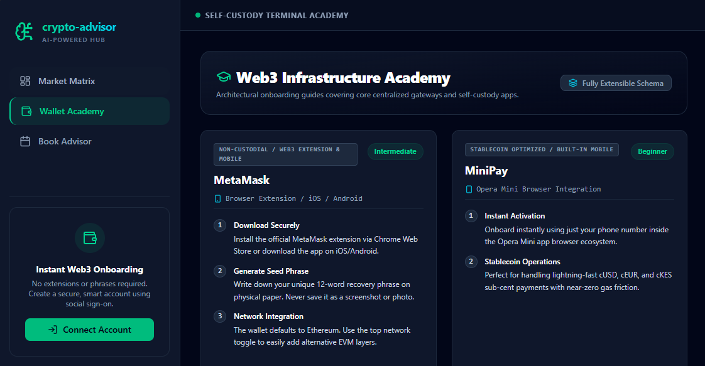
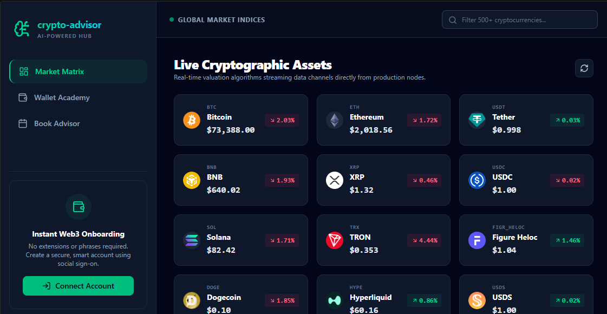
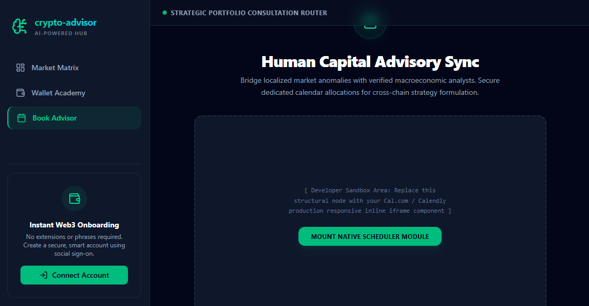

# 🏛️ Crypto Advisor: Next-Gen Web3 Advisory Ecosystem

An elite, production-grade Web3 application combining **Account Abstraction (AA)**, real-time cryptographic asset monitoring, institutional-grade automated **AI market advisory analysis**, and human capital scheduling routers.

Built with a modular, configuration-driven schema, this application bridges traditional Web2 web accessibility with advanced Web3 infrastructure.

---

## 🚀 Core Production Tech Stack

* **Core Engine UI:** React (Vite-Powered Component Lifecycle compilation)
* **Styling Layer:** Tailwind CSS (Dark-Mode Utility Protocol Grid)
* **Web3 Identity Context:** Privy SDK (ERC-4337 Layer-2 Smart Account provisioning)
* **Predictive Intelligence:** Google Gemini AI Ecosystem (`gemini-2.5-flash`)
* **Live Market Telemetry:** CoinGecko Public Data Feed API REST Rails
* **Component Vector Icons:** Lucide React

---

## 🗺️ Application Core Architecture Workflows

### 🔄 System Runtime Pathways

#### Account Abstraction Onboarding Workflow
Traditional crypto onboarding forces users through manual wallet extensions and seed phrase retention. This system utilizes an abstract cryptographic key-management loop to initialize secure identities via frictionless Web2 credentials.

```text
  ┌───────────────────────────────┐
  │   User Social Auth Trigger    │  ◄── Google, Apple, or Email authentication
  └───────────────┬───────────────┘
                  │
                  ▼
  ┌───────────────────────────────┐
  │  Privy Key-Sharding Engine    │  ◄── TEE / Shamir Secret Sharing infrastructure
  └───────────────┬───────────────┘
                  │
                  ▼
  ┌───────────────────────────────┐
  │   ERC-4337 Smart Account      │  ◄── Automatic embedded wallet orchestration
  └───────────────┬───────────────┘
                  │
                  ▼
  ┌───────────────────────────────┐
  │  Deterministic State Injection │  ◄── Injects secure address into AuthContext
  └───────────────────────────────┘


┌───────────────────────────────┐
  │   User Selects Asset Card     │  ◄── Triggers interface element focus
  └───────────────┬───────────────┘
                  │
                  ▼
  ┌───────────────────────────────┐
  │  React State Interception    │  ◄── Grabs live Price, Volatility, & Caps
  └───────────────┬───────────────┘
                  │
                  ▼
  ┌───────────────────────────────┐
  │   Structured Prompt Mapping   │  ◄── Builds deterministic JSON analysis context
  └───────────────┬───────────────┘
                  │
                  ▼
  ┌───────────────────────────────┐
  │     Gemini Inference Run      │  ◄── Executes quant logic via secure Edge Rails
  └───────────────┬───────────────┘
                  │
                  ▼
  ┌───────────────────────────────┐
  │   Technical Analysis Modal    │  ◄── Renders custom structured dashboard overlay
  └───────────────────────────────┘
```
  ---
  

### 2. Repository File Architecture Tree

#### 📂 Directory Architecture
```
crypto-advisor/
 ├── .env                         ──  Hardware Cryptographic Keys & API Credentials
 ├── index.html                   ──  Core DOM Root Injection Target
 ├── package.json                 ──  Node Runtime Package Registry Configuration
 ├── vite.config.js               ──  Vite Build Pipeline Directory Core Configuration
 └── src/
      ├── main.jsx                ──  Context Provider Initialization Entrypoint
      ├── App.jsx                 ──  Global Tab Workspace Router Engine
      ├── index.css               ──  Tailwind Core Framework Context Layer
      │
      ├── components/
      │    ├── AccountCard.jsx    ──  Account Abstraction Interactive Controller
      │    └── AdvisorModal.jsx   ──  Gemini Powered Quant Analysis Terminal Overlay
      │
      ├── data/
      │    └── wallets.js         ──  JSON Extensible Multi-Chain Wallet Schema Registry
      │
      └── services/
           ├── cryptoApi.js       ──  Production CoinGecko Data Integration Channel
           └── aiApi.js           ──  Google Gen AI Framework Context Bridge

```
---

### 3. Core Interface & AI Modal Blueprints

### 🖥️ Application UI Wireframes

#### Global Active Work Environment

```
┌─────────────────────────────────────────────────────────────────────────────┐
│ CRYPTO-ADVISOR │ AI HUB                 │  [🟢 Global Active Terminal Node] │
├──────────────────────────────┬──────────────────────────────────────────────┤
│                              │  Search Assets... [_______________________]  │
│  📋 Market Matrix            ├──────────────────────────────────────────────┤
│  👛 Wallet Academy           │                                              │
│  📅 Book Advisor             │  ┌──────────────┐  ┌──────────────┐  ┌──────┐│
│                              │  │ Bitcoin BTC  │  │ Ethereum ETH │  │ ...  ││
│                              │  │ $67,432.00   │  │ $3,512.20    │  │      ││
│                              │  │ [🔼 +3.42%]  │  │ [🔽 -1.15%]  │  │      ││
├──────────────────────────────┤  └──────────────┘  └──────────────┘  └──────┘│
│                              │                                              │
│ [🔒 Smart Account Active]    │                                              │
│ 0x74a...9b42         [Copy]  │                                              │
│ Gas-Sponsorship: Ready       │                                              │
└──────────────────────────────┴──────────────────────────────────────────────┘

┌──────────────────────────────────────────────────────────────┐
│ 🪙 Bitcoin AI Terminal [Brain Engine Online]             [X] │
├──────────────────────────────────────────────────────────────┤
│  [Price: $67,432.00]   [24h Change: +3.42%]   [Rank: #1]     │
├──────────────────────────────────────────────────────────────┤
│  📊 Market Sentiment Profile                                 │
│  Macro momentum patterns reveal massive accumulation walls.  │
│                                                              │
│  🛡️ Core Risk Assessment                                    │
│  Immediate resistance clustered at $68,500 psychological zone│
│                                                              │
│  🎯 Strategic Position Recommendation                        │
│  ACCUMULATION: Dollar-cost-average parameters active.        │
├──────────────────────────────────────────────────────────────┤
│ ⚠️ Summaries are educational and do not constitute advice.   │
└──────────────────────────────────────────────────────────────┘
  ```

### 🖥️ Platform Preview

<p align="center">
  
  
  
</p>

### 📊 System Runtime Pathway

```text
  ┌─────────────────────────────────────────────────────────┐
  │                   VITE CLIENT ENGINE                    │
  │  (React 19 Core App State & Tailwind CSS v4 Ecosystem)  │
  └────────────────────────────┬────────────────────────────┘
                               │
            ┌──────────────────┼──────────────────┐
            ▼                  ▼                  ▼
┌──────────────────────┐ ┌───────────┐ ┌──────────────────────┐
│     AUTH CONTEXT     │ │  ROUTER   │ │     SERVICES HUB     │
│ (Active State Logic) │ │ (Routing) │ │ (Data Orchestration) │
└───────────┬──────────┘ └─────┬─────┘ └──────────┬───────────┘
            │                  │                  │
            ▼                  ▼                  ▼
┌──────────────────────┐ ┌───────────┐ ┌──────────────────────┐
│      PRIVY SDK       │ │ BASE URL  │ │      COINGECKO       │
│ Account Abstraction  │ │ Subfolder │ │ Live Market Metrics  │
└──────────────────────┘ └───────────┘ └──────────────────────┘
```
